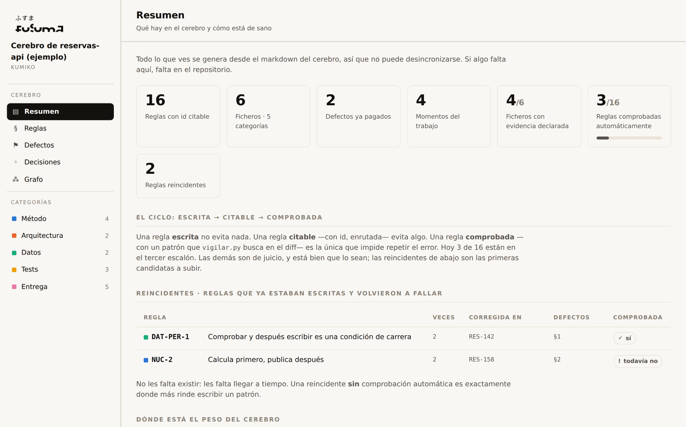
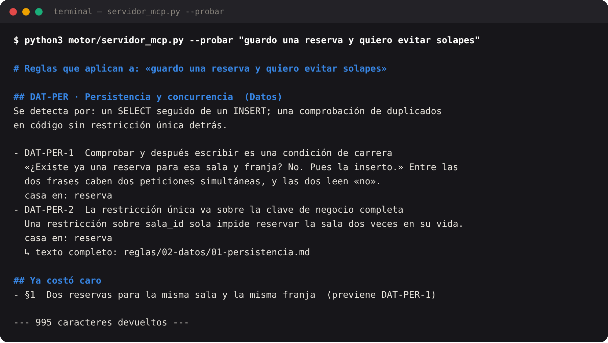
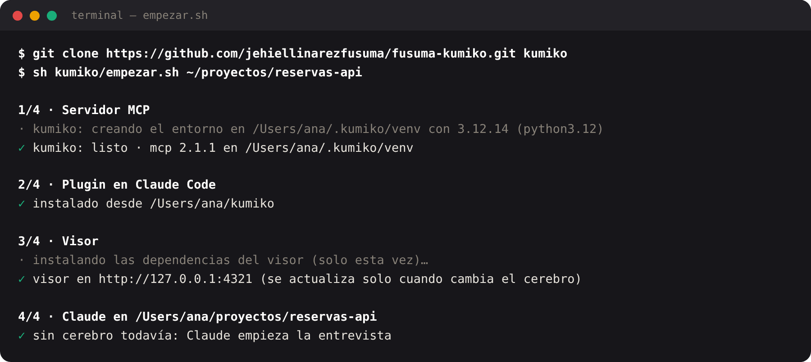
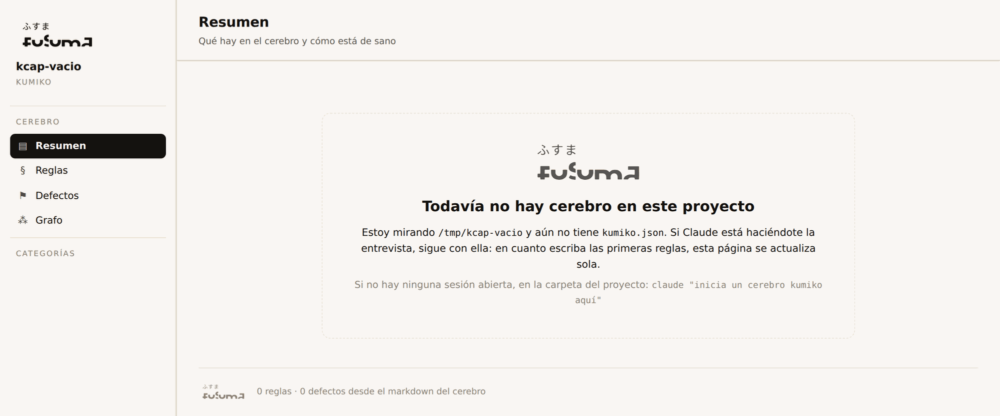
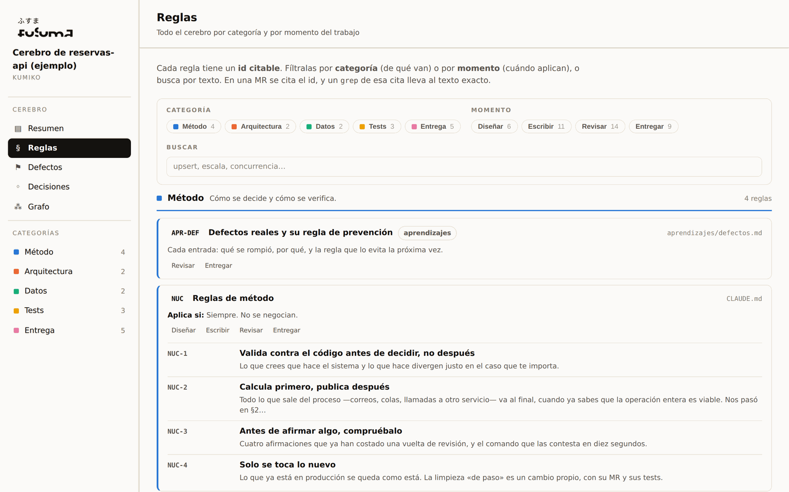
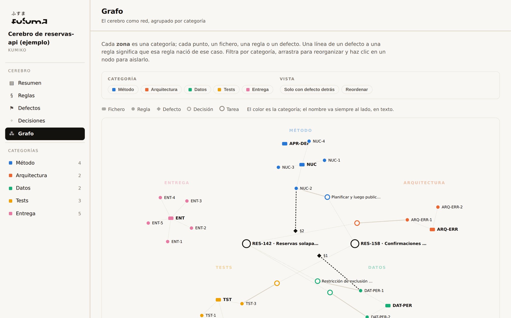
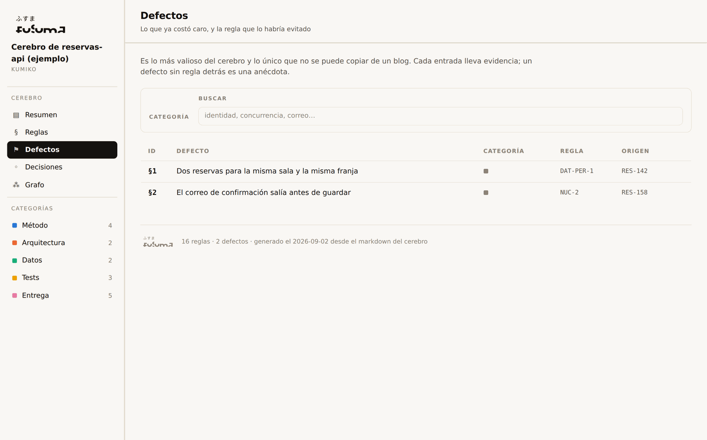

# kumiko

Motor de cerebro de contexto para equipos que trabajan con agentes.

<picture>
  <source media="(prefers-color-scheme: dark)" srcset="docs/capturas/resumen-dark.png">
  
</picture>

> *Kumiko* es el entramado de listones finos que sostiene un panel japonés. No es el papel:
> es la estructura que lo mantiene en su sitio. Esto tampoco es tu contenido — es lo que hace
> que se pueda encontrar.

## El problema

Tienes un `CLAUDE.md`, unas notas, o un `docs/` con convenciones. Y aun así la IA —y las
personas— se saltan reglas que estaban escritas. Casi nunca falta contenido: **la regla existe
y no llega al momento en que hacía falta.**

kumiko convierte esas notas en un cerebro consultable **por tarea**. Cada regla tiene un id
citable, cada fichero declara cuándo aplica, y un servidor MCP devuelve solo lo que toca:

```
«voy a guardar una reserva y evitar solapes»

  DAT-PER-1  Comprobar y después escribir es una condición de carrera
  DAT-PER-2  La restricción única va sobre la clave de negocio completa
  §1         Dos reservas para la misma sala y la misma franja  ← ya costó caro
```

Mil caracteres en vez del cerebro entero.



---

## 1. Empieza con una orden

```bash
git clone https://github.com/jehiellinarezfusuma/fusuma-kumiko.git kumiko
sh kumiko/empezar.sh /ruta/a/tu/proyecto
```

Eso hace todo lo que hay que hacer, en orden y sin preguntar: deja listo el Python del servidor
MCP (en un entorno propio, `~/.kumiko/venv`), registra el plugin en Claude Code, abre el visor
en el navegador y arranca Claude dentro de tu proyecto **ya haciéndote la entrevista** para
montar el cerebro. Mientras contestas, el visor se va rellenando solo con lo que Claude escribe.
Si el proyecto ya tiene cerebro, Claude arranca enseñándote su mapa. Puedes lanzarlo tantas
veces como quieras: lo que ya está hecho, lo salta.



Necesitas Claude Code y, para el visor, node. Sin node todo funciona igual, salvo el panel.

Mientras Claude te entrevista, el visor espera así, y en cuanto aparece la primera regla se rellena solo:

<picture>
  <source media="(prefers-color-scheme: dark)" srcset="docs/capturas/espera-dark.png">
  
</picture>

Para verlo funcionar antes de tocar tu proyecto, el repositorio trae un cerebro inventado (un
servicio de reserva de salas, 16 reglas y 2 defectos): `sh kumiko/empezar.sh kumiko/ejemplo`.
Su contenido no te vale; **su estructura sí**.

Y sin abrir Claude, para ver qué devuelve el servidor:

```bash
cd kumiko/ejemplo
python3 ../motor/servidor_mcp.py --probar "guardo una reserva y quiero evitar solapes"
python3 ../motor/servidor_mcp.py --medir
```

---

## 2. Instalar a mano (si no usas `empezar.sh`)

Los plugins de Claude Code se instalan desde un marketplace, aunque sea local. Este
repositorio **es** su propio marketplace, así que basta con apuntarlo, desde la terminal:

```bash
claude plugin marketplace add /ruta/a/kumiko        # o la URL del repositorio
claude plugin install kumiko@kumiko --scope user
```

O dentro de una sesión: `/plugin marketplace add /ruta/a/kumiko` y `/plugin install kumiko@kumiko`.
En GitLab autoalojado la URL lleva el `.git` final. Para trastear sin instalar, cargándolo solo
en esa sesión: `claude --plugin-dir /ruta/a/kumiko`.

Comprueba que ha entrado con `/skills` (salen cuatro) y `/mcp` (el servidor `kumiko`, con seis
herramientas).

**Requisitos.** Los scripts del motor valen con Python 3.9 en adelante y no necesitan nada más.
El servidor MCP necesita además el paquete `mcp`, que exige **Python >= 3.10**. Una sola orden lo
deja listo, sin tocar ningún Python del sistema (`empezar.sh` la lanza por ti):

```sh
sh /ruta/a/kumiko/motor/instalar.sh
```

Busca un Python >= 3.10 (`python3.12`, Homebrew…), crea un entorno virtual en `~/.kumiko/venv` e
instala `mcp` dentro. El plugin arranca el servidor con `motor/lanzar_servidor.sh`, que mira ese
entorno primero y después los Pythons habituales, así que no hay que configurar nada. En macOS el
`python3` del sistema es 3.9 y Homebrew no deja hacer `pip install` fuera de un venv: por eso el
instalador, no un `pip install` a mano. Si no tienes ningún Python moderno: `brew install
python@3.12` y repite. Si ya tienes uno con `mcp` en otro sitio, `export KUMIKO_PYTHON=/ruta`.

## 3. Móntalo en tu proyecto

### Camino corto: que Claude te entreviste

En el repositorio donde programas:

> «inicia un cerebro kumiko aquí»

Claude **lee el proyecto antes de preguntar nada** — el README, las convenciones que ya tengáis
escritas, y sobre todo `git log` buscando commits de *fix review comments*, que es donde vive lo
que el equipo ya aprendió a la fuerza. Resume lo que ha encontrado y entonces te entrevista.

La primera pregunta es la que importa: **¿qué te ha devuelto una MR últimamente?** De ahí salen
las primeras reglas, y son las únicas que alguien va a usar.

Al terminar tienes un cerebro con contenido real, no plantillas vacías.

### Camino manual: cinco ficheros

Si no usas Claude Code, o prefieres entender la mecánica antes de automatizarla. Los ficheros
comentados están en [`plantillas/`](plantillas/).

**1. La configuración.** `kumiko.json` en la raíz del cerebro. Es lo único obligatorio, y lo que
marca la raíz — el motor lo busca subiendo directorios, como git con `.git`.

```jsonc
{
  "nombre": "Cerebro de mi-api",
  "categorias": [
    { "id": "metodo", "nombre": "Método", "descripcion": "Cómo se decide y cómo se verifica." },
    { "id": "datos",  "nombre": "Datos",  "descripcion": "Persistencia y concurrencia." }
  ],
  "momentos": [
    { "id": "escribir", "nombre": "Escribir" },
    { "id": "revisar",  "nombre": "Revisar" }
  ]
}
```

Empieza con **cuatro o cinco categorías**, no con doce. Salen del código que ya tienes, no de
una lista canónica.

**2. El router.** `CLAUDE.md`, con dos o tres reglas de método — las que el equipo ya sabe que
se salta:

```markdown
## NUC-1 · Valida contra el código antes de decidir

Lo que crees que hace el sistema y lo que hace divergen justo en el caso que te importa.
```

**3. Un fichero de reglas.** `reglas/01-datos/01-escrituras.md`. El frontmatter no es adorno:

```markdown
---
id: DAT
titulo: Escrituras
tipo: regla
categoria: datos
momentos: [escribir]
resumen: >-
  La unicidad la garantiza la base de datos, no tu código.
aplica_si: >-
  Escribes en la base de datos o compruebas si algo ya existe antes de insertarlo.
senal_de_incumplimiento: >-
  Un SELECT seguido de un INSERT.
evidencia: src/pedidos/CrearPedido.kt:33
---

## DAT-1 · Comprobar y después escribir es una carrera

Entre el `SELECT` y el `INSERT` caben dos peticiones. La restricción va en la tabla.
```

`aplica_si` y `senal_de_incumplimiento` son **lo que el servidor usa para enrutar**. Escríbelas
como frases con los términos que la gente usaría, no como etiquetas.

**4. El primer defecto.** `aprendizajes/defectos.md`. Es la parte que más rinde y la única que
nadie puede copiarte:

```markdown
## §1 · Dos pedidos con el mismo número (TCK-9)

**Síntoma.** Dos pedidos con número 1042.
**Causa.** `CrearPedido.kt:33` leía el máximo y sumaba uno.
**Regla.** Previene: `DAT-1`.
```

El título dice **qué se hizo mal**, no cuál fue el arreglo: dentro de seis meses nadie reconoce
su propio caso en «Añadir restricción única».

**5. Genera y comprueba.**

```bash
python3 /ruta/a/kumiko/motor/construir_indice.py
python3 /ruta/a/kumiko/motor/comprobar.py
```

Con eso ya tienes un cerebro que responde. Dos reglas y un defecto bastan para empezar; doce
ficheros vacíos no sirven para nada.

### ¿Dónde vive el cerebro?

**En el mismo repositorio que el código** si es un proyecto único: no hay nada que configurar,
el motor sube directorios hasta encontrar `kumiko.json`.

**En un repositorio aparte** si cubre varios servicios — que es lo normal en cuanto hay más de
uno. Entonces deja un puntero en la raíz de cada proyecto:

```bash
echo "../mi-cerebro" > .kumiko-cerebro
```

La ruta puede ser relativa al propio fichero, para que la copia de cada uno funcione. Si no,
está `KUMIKO_CEREBRO`. Si no encuentra ninguno, lo dice y explica las tres opciones.

## 4. El día a día

El cerebro solo sirve si crece con lo que os pasa. Cuatro momentos:

| Cuándo | Qué haces |
|---|---|
| **Antes de escribir código** | El agente llama a `reglas_para_tarea` solo. Tú describe lo que vas a tocar. |
| **Una revisión te pilla algo** | `/kumiko:anotar-defecto` ← el más valioso, y el que se olvida |
| **«esto debería ser una regla»** | `/kumiko:anadir-regla` |
| **Antes de pedir revisión** | `/kumiko:antes-de-entregar` |

Las tres skills que escriben **exigen evidencia** y paran si no la hay: un `fichero:línea`, un
hash de commit o un comentario de revisión real. *«Conviene tener cuidado con X»* no entra.

Y `anadir-regla` consulta el cerebro antes de escribir: si ya existe algo parecido, refuerza la
regla que hay en vez de crear una segunda redacción. Dos redacciones de la misma regla es como
empieza a caducar un cerebro.

Después de tocar cualquier markdown: `construir_indice.py`. El índice se genera, no se escribe.

## 5. El visor

Un panel que hace legible cualquier cerebro: reglas por categoría y momento con buscador, los
defectos filtrables, y un grafo donde se ve de un vistazo qué reglas tienen un caso real detrás
y cuáles no ha tocado nadie.

`empezar.sh` lo abre por ti. A mano:

```bash
cd visor && npm install
KUMIKO_CEREBRO=/ruta/a/tu/proyecto npm run dev      # http://localhost:4321
```

No hay que generar nada antes: el visor regenera los datos desde el markdown al arrancar y
**vigila el cerebro**; cuando Claude o tú escribís una regla, anotáis un defecto o creáis el
`kumiko.json` de un proyecto nuevo, se recarga solo. En un proyecto sin cerebro enseña una
pantalla de espera hasta que aparece. Sin `KUMIKO_CEREBRO` muestra el de `ejemplo/`. Modo claro
y oscuro, tu logo si lo quieres, y los colores salen de tus categorías. Detalles en
[`visor/README.md`](visor/README.md).


**Reglas**, por categoría y momento, con buscador; el ⚙ marca las que tienen comprobación automática:

<picture>
  <source media="(prefers-color-scheme: dark)" srcset="docs/capturas/reglas-dark.png">
  
</picture>

**Grafo**: cada zona es una categoría; los rombos son defectos y la línea discontinua une cada uno con la regla que nació de él. Lo que no tiene ninguna línea, nadie lo ha pagado todavía:

<picture>
  <source media="(prefers-color-scheme: dark)" srcset="docs/capturas/grafo-dark.png">
  
</picture>

**Defectos**: lo que ya costó caro, filtrable, y qué regla lo previene ahora:

<picture>
  <source media="(prefers-color-scheme: dark)" srcset="docs/capturas/defectos-dark.png">
  
</picture>

## 6. El servidor MCP

Se registra solo al instalar el plugin.

| Herramienta | Para qué |
|---|---|
| `reglas_para_tarea(tarea, momento?)` | Lo que se llama **antes** de escribir código. |
| `regla(id)` · `defecto(id)` | El texto completo de una, cuando hace falta. |
| `checklist_entrega()` | Antes de decir «hecho». |
| `buscar(texto)` | Término literal → ids donde aparece. |
| `mapa()` | Para orientarse la primera vez. |

El emparejado es determinista y sin embeddings, en dos etapas: el `aplica_si` decide **qué
tema** y el texto de cada regla decide **cuál dentro del tema**. Por eso el servidor puede
decirte *por qué* eligió cada regla — y cuando se equivoca, **se arregla la frase del
frontmatter, no el algoritmo**.

## 7. El harness: que la regla llegue sin que nadie se acuerde

Todo lo anterior sigue dependiendo de que el agente **decida** consultar el cerebro. El
harness quita esa decisión de en medio: cinco hooks de Claude Code que vienen con el plugin y
trabajan solos. `UserPromptSubmit` enruta lo que pides y mete en el contexto las reglas que
casan, con su id. `PostToolUse` pasa las comprobaciones por cada fichero que el agente escribe
y le devuelve los hallazgos en el acto. `PreToolUse` no deja hacer `git commit` con hallazgos
que bloquean. `Stop` revisa todo lo pendiente antes de dar la tarea por hecha. Y
`SessionStart` presenta el cerebro al empezar.

Como todo lo que hace deja rastro, se puede **medir**: la telemetría (`.kumiko/consultas.jsonl`)
dice qué se consulta, qué se devuelve y qué reglas paran errores de verdad; y
`motor/evaluar.py` pasa un conjunto de consultas con respuesta conocida
(`evaluaciones/consultas.jsonl`) por el enrutado y falla en CI si el recall baja. Las consultas
que la telemetría registra sin resultado son los casos que hay que añadir a la evaluación, y
cuando una falla, se arregla la frase del `aplica_si`, no el algoritmo. El visor lo enseña todo
en la página **Harness**.

<picture>
  <source media="(prefers-color-scheme: dark)" srcset="docs/capturas/harness-dark.png">
  
</picture>

```bash
python3 motor/evaluar.py                 # ¿acierta el enrutado? recall y precisión por consulta
echo '{"prompt":"guardo una reserva"}' | python3 motor/harness.py prompt    # probar un hook a mano
```

Cada pieza se apaga por separado en `kumiko.json` → `harness`. Cómo funciona por dentro, el
contrato de cada hook y lo que todavía no hace: [`docs/HARNESS.md`](docs/HARNESS.md).

## 8. Probarlo

```bash
sh motor/instalar.sh                         # una vez: el entorno con mcp
python3 motor/prueba_humo.py                 # sobre el cerebro de ejemplo
python3 motor/prueba_humo.py /mi/cerebro     # sobre el tuyo
```

Seis comprobaciones: que el generador escribe, que el comprobador da el cerebro por bueno, que
**detecta uno roto** —un comprobador que nunca falla no comprueba nada—, que el servidor
responde por consola, que habla MCP de verdad por stdio (`initialize`, `tools/list`,
`tools/call`) y que el visor compila.

Esa quinta es la que importa: un servidor MCP casi siempre falla en el diálogo, no en la
lógica, y no te enteras hasta que el agente dice que la herramienta no existe.

`comprobar.py` y `prueba_humo.py` salen con código 1 si algo va mal. En CI:

```yaml
cerebro:
  script:
    - python3 motor/construir_indice.py
    - git diff --exit-code       # el índice generado tiene que estar al día en el commit
    - python3 motor/comprobar.py
```

Ese `git diff --exit-code` evita el fallo más común: alguien edita una regla, no regenera el
índice, y el índice empieza a mentir.

## 9. Cuando algo no funciona

| Síntoma | Qué pasa |
|---|---|
| `/mcp` muestra kumiko con **0 herramientas** o «failed» | No hay un Python >= 3.10 con `mcp` (`sh motor/instalar.sh`, paso 2), o el servidor no encuentra el cerebro. `sh /ruta/a/kumiko/motor/lanzar_servidor.sh --probar "algo"` te dice cuál de las dos, y `claude --debug=mcp` enseña el log. |
| Las herramientas contestan **«Este proyecto todavía no tiene un cerebro kumiko»** | Es lo esperado en un proyecto nuevo: pide «inicia un cerebro kumiko aquí». Si el cerebro vive en otro repositorio, deja un `.kumiko-cerebro` con la ruta. El servidor lo detecta solo, sin reiniciar Claude, igual que cualquier regla que edites. |
| `reglas_para_tarea` **no encuentra nada** | El `aplica_si` de tus ficheros no habla el idioma de la consulta. Reescríbelo con los términos que usaría la gente — no toques el motor. |
| Devuelve **reglas que no tocaban** | Lo mismo por el otro lado: el `aplica_si` es demasiado genérico. La respuesta te dice en qué palabras casó. |
| `comprobar.py` **falla tras editar** | Casi siempre es una cita a un id que no existe, o el índice de defectos desincronizado. El mensaje dice cuál. |
| Los hooks **no hacen nada** | `claude --debug` enseña si se cargaron. Prueba uno a mano con `echo '{"prompt":"…"}' \| python3 motor/harness.py prompt` desde la raíz del proyecto: si contesta, el problema es de Claude Code; si no, del cerebro (¿hay `kumiko.json`?). |
| `evaluar.py` **falla** tras editar un `aplica_si` | Es para lo que existe: mira qué consulta perdió recall y devuelve las palabras que quitaste, o añade las nuevas. |
| El visor **no arranca** o no refleja un cambio | Mira `~/.kumiko/visor.log` (con `empezar.sh`) o la consola de `npm run dev`: si `construir_indice.py` falla por un markdown mal formado, ahí sale el motivo. |

## 10. Qué hay aquí

```
empezar.sh      la única orden que hace falta después de clonar
motor/          los scripts, el núcleo, el harness (hooks), la evaluación, el instalador y el lanzador
hooks/          los cinco hooks de Claude Code que vienen con el plugin
skills/         las cuatro skills del plugin
visor/          el panel en Astro, sirve cualquier cerebro
plantillas/     los ficheros de arranque, comentados, y el hook de pre-commit
ejemplo/        un cerebro completo y ficticio: reserva de salas
docs/           ANATOMIA.md (cómo se escribe) · COMO-FUNCIONA.md (por qué así) · HARNESS.md (lo que hace solo)
```

```bash
python3 motor/construir_indice.py    # genera el índice y los datos desde el markdown
python3 motor/comprobar.py           # rutas, ids, frontmatter y duplicados
python3 motor/servidor_mcp.py --probar "..."   # ver qué devolvería
python3 motor/servidor_mcp.py --medir          # coste frente a cargarlo todo
python3 motor/evaluar.py             # recall y precisión del enrutado
python3 motor/harness.py <hook>      # lo que ejecutan los hooks del plugin
python3 motor/prueba_humo.py         # el ciclo entero
```

Python puro (3.9 o más), sin dependencias salvo `mcp` para el servidor, que pide Python >= 3.10 y se instala con `sh motor/instalar.sh`.

## Lo que no hace

No valida que tus reglas sean buenas: valida que sean **encontrables**. No sustituye la
revisión humana. Y no aprende solo — un defecto entra porque alguien lo escribe, con evidencia.

Tampoco es gratis: los ids, el frontmatter y el índice son overhead, y en un cerebro real
medido el corpus creció un **34%**. Lo que se reduce no es el cerebro, es **la lectura** — y eso
solo se cobra si el agente lee selectivamente. Si tu contexto cabe entero, no montes nada de
esto. Los números y el razonamiento, en [`docs/COMO-FUNCIONA.md`](docs/COMO-FUNCIONA.md).
