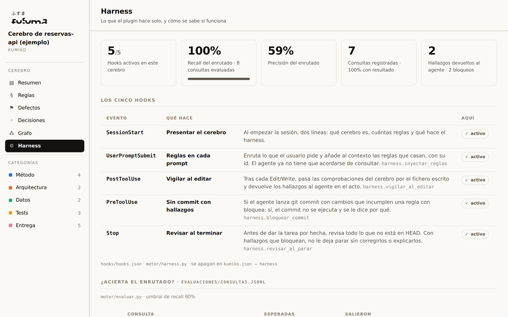

# El harness: que la regla llegue sin que nadie se acuerde

Un cerebro bien escrito, con ids, enrutado y servido por MCP, sigue teniendo un punto débil:
el agente tiene que **decidir** consultarlo. A veces lo hace y a veces no, y cuando no lo hace
la regla vuelve a ser literatura. El harness es el andamiaje que quita esa decisión de en
medio: cinco hooks de Claude Code que enrutan, vigilan y paran solos, más la telemetría y la
evaluación que dicen si de verdad funcionan.

La idea, en una frase: *no confíes en que el modelo se acuerde; construye lo que le obliga, lo
mide y lo corrige.*



## Los cinco hooks

Se declaran en [`hooks/hooks.json`](../hooks/hooks.json) y los ejecuta un solo script,
[`motor/harness.py`](../motor/harness.py), que lee el JSON del hook por stdin y contesta por
stdout. Vale con Python 3.9 y no necesita `mcp`.

| Evento | Orden | Qué hace | Se apaga con |
|---|---|---|---|
| `SessionStart` | `sesion` | Presenta el cerebro en dos líneas: nombre, reglas, comprobaciones, qué hace el harness. | — |
| `UserPromptSubmit` | `prompt` | Enruta lo que el usuario pide con el mismo `busca()` del servidor y añade al contexto las reglas que casan, con id y resumen, y los defectos que ya costaron caro. Ignora comandos (`/…`) y prompts de menos de cuatro palabras. | `harness.inyectar_reglas` |
| `PostToolUse` (`Edit\|Write\|MultiEdit\|NotebookEdit`) | `tras-editar` | Pasa las `comprobaciones` del cerebro por el fichero recién escrito. Con hallazgos, se los devuelve al agente en el acto (`decision: block` con el motivo), no en el pre-commit. | `harness.vigilar_al_editar` |
| `PreToolUse` (`Bash`) | `antes-de-bash` | Si el comando es un `git commit`, revisa lo preparado. Con hallazgos que `bloquea: sí`, deniega el comando (`permissionDecision: deny`) y explica por qué. | `harness.bloquear_commit` |
| `Stop` | `al-parar` | Antes de que Claude dé la tarea por hecha, revisa todo lo que no está en `HEAD` (diff más ficheros nuevos). Con hallazgos que bloquean, no le deja parar sin corregirlos o explicarlos. Respeta `stop_hook_active` para no entrar en bucle. | `harness.revisar_al_parar` |

Todos comparten tres reglas: sin cerebro en el proyecto no hacen nada (salvo decirlo una vez
al empezar); un error interno nunca rompe la sesión (se escribe en stderr y se sale con 0); y
cada uno deja rastro en la telemetría.

Probar cualquiera a mano, desde la raíz de un proyecto con cerebro:

```bash
echo '{"prompt":"guardo una reserva y quiero evitar solapes"}' | python3 /ruta/a/kumiko/motor/harness.py prompt
echo '{"tool_name":"Write","tool_input":{"file_path":"src/Reserva.kt"}}' | python3 /ruta/a/kumiko/motor/harness.py tras-editar
```

### Configuración

En `kumiko.json`, todo opcional:

```json
"harness": {
  "inyectar_reglas": true,
  "vigilar_al_editar": true,
  "bloquear_commit": true,
  "revisar_al_parar": true,
  "minimo_palabras": 4,
  "maximo_caracteres": 1800
}
```

`maximo_caracteres` acota lo que se inyecta en cada prompt: el harness no debe convertirse en
la forma nueva de cargar el cerebro entero.

## La telemetría: qué se consulta de verdad

Cada consulta al servidor MCP y cada hook escriben una línea en `.kumiko/consultas.jsonl`
(ruta en `rutas.telemetria`). Es estado local: está en `.gitignore` y no va al índice.

```json
{"ts": "2026-09-03T08:30:58", "origen": "hook:prompt", "consulta": "voy a guardar una reserva…", "ids": ["DAT-PER-1", "DAT-PER-2"]}
{"ts": "2026-09-03T08:30:58", "origen": "hook:editar", "consulta": "src/reservas/CrearReserva.kt", "ids": ["ARQ-ERR-2"], "bloqueo": true}
```

`motor/telemetria.py` la resume y el visor la enseña en la página **Harness**: por dónde
llegan las consultas, qué reglas se devuelven más, qué reglas están parando errores, y sobre
todo **las consultas sin resultado**. Cada una de esas es un `aplica_si` que no habla el idioma
de quien pregunta, o un tema que el cerebro no tiene. Es el trabajo pendiente, ordenado solo.

## La evaluación: ¿acierta el enrutado?

`evaluaciones/consultas.jsonl` (ruta en `rutas.evaluaciones`) guarda consultas con respuesta
conocida, una por línea:

```json
{"consulta": "guardo una reserva y quiero evitar solapes", "esperadas": ["DAT-PER-1", "DAT-PER-2"]}
{"consulta": "qué reviso antes de abrir la MR", "esperadas": ["ENT-1"], "no_esperadas": ["DAT-PER-1"]}
{"consulta": "refactorizo el nombre de un método", "esperadas": [], "no_esperadas": ["DAT-PER-1"]}
```

`python3 motor/evaluar.py` pasa cada una por el mismo enrutado que usa el servidor y mide
recall (de lo esperado, cuánto salió) y precisión (de lo que salió, cuánto era esperado). Sale
con código 1 si el recall medio baja de `evaluacion.umbral_recall` (0,8 por defecto): en CI,
nadie puede empeorar el enrutado sin enterarse. `construir_indice.py` deja el resultado en
`cerebro.json` y una línea en el índice.

De dónde salen los casos: de la telemetría. Una consulta que el harness registró sin resultado
y que alguien resolvió a mano entra aquí con el id que tendría que haber salido. Así cada
fallo de enrutado se convierte en un caso de prueba, y el `aplica_si` deja de retocarse a
ciegas. Cuando una consulta falla, **se arregla la frase, no el algoritmo**; el cerebro de
ejemplo trae ocho casos, y dos de ellos fallaron la primera vez exactamente por eso.

## El bucle completo

```
  el agente trabaja ──► hooks: reglas inyectadas, ficheros vigilados, commit y parada revisados
         │                                   │
         │                                   ▼
         │                        telemetría: qué se preguntó, qué salió, qué paró
         │                                   │
         ▼                                   ▼
  revisión de la MR ──► anotar-defecto ──► reglas nuevas / comprobaciones nuevas
                                             │
                                             ▼
                        consultas sin resultado ──► casos de evaluación ──► aplica_si mejor
```

Escrita → citable → comprobada era el ciclo de una regla. Esto es el ciclo del cerebro entero:
lo que no llega, se ve; lo que se ve, se convierte en caso; lo que es caso, no vuelve a fallar
en silencio.

## Lo que no hace, todavía

- No lee los comentarios de la MR por sí mismo. Cerrar ese bucle (API de GitLab/GitHub →
  `anotar-defecto` en modo propuesta) es la pieza siguiente.
- No cruza automáticamente «regla devuelta» con «regla corregida en revisión». Los datos ya
  están en la telemetría y en `decisiones.json`; falta el cálculo.
- El enrutado sigue siendo por palabras. La evaluación existe precisamente para saber cuándo
  eso deja de bastar, antes de cambiarlo por algo que no sepa explicar por qué eligió.
